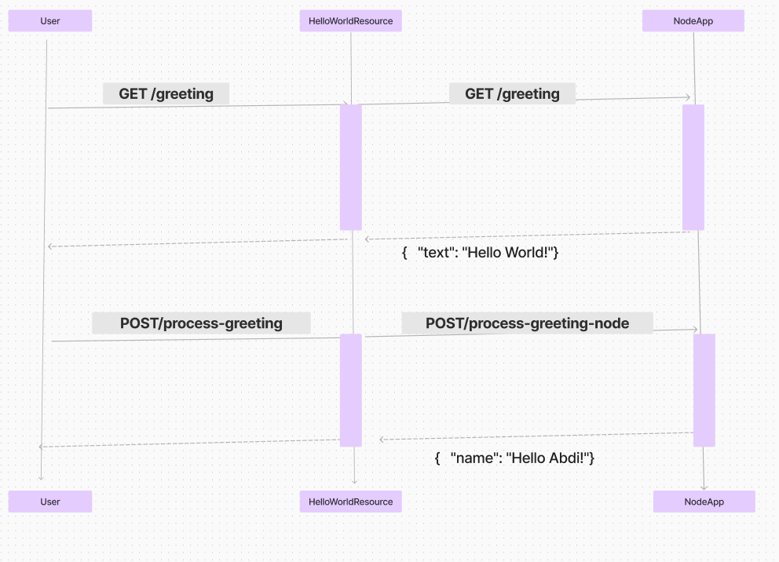

# What is the Application?

A simple REST API web service consisting of two microservices. The application includes a Java web application that exposes a REST API, which communicates with an Express application.

## Endpoints


### Dropwizard Endpoints

1. **Retrieve a greeting**

    - **Request:**
        - Method: `GET`
        - URL: `/greeting`
        - Example Request:
          ```
          GET /greeting
          ```

    - **Response:**
        - Status Code: `200 OK`
        - Example Response:
          ```
          {
            "text": "hello world"
          }
          ```

2. **post a greeting**

    - **Request:**
        - Method: `POST`
        - URL: `/process-greeting`
        - Example Request:
          ```
          POST /process-greeting
          Content-Type: application/json

          {
            "name": "Hello from John"
          }
          ```

    - **Response:**
        - Status Code: `200 OK`
        - Example Response:
          ```
          { 
            "name": "HELLO FROM JOHN"
          }
          ```

### Node Endpoints

1. **Retrieve a greeting**

    - **Request:**
        - Method: `GET`
        - URL: `/greeting`
        - Example Request:
          ```
          GET /greeting
          ```

    - **Response:**
        - Status Code: `200 OK`
        - Example Response:
          ```
          { 
            "text": "Hello World"
          }
          ```

2. **post a greeting**

    - **Request:**
        - Method: `POST`
        - URL: `/process-greeting-node`
        - Example Request:
          ```
          POST /process-greeting-node
          Content-Type: application/json

          {
            "name": "Hello Ali"
          }
          ```

    - **Response:**
        - Status Code: `200 OK`
        - Example Response:
          ```
          {  
            "name": "Hello from Ali"
          }
          ```


## How the Application Works

- The `HelloWorldResource` handles HTTP requests and forwards them to the appropriate endpoints in the Node.js service using JAX-RS.
- Responses from the Node.js service are then processed by the `HelloWorldResource` and sent back to the client.
- JAX-RS is the JavaEE API that provides API annotations like `@GET`, `@POST`, Jersey implements the JAX-RS API and handles the routing of HTTP requests to the appropriate methods.
- The application configuration is contained in `app.yml` which is deserialized using Jackson into `AppConfiguration`.
- Jackson is also used for deserializing the requests and responses to/from Dropwizard.
 ### How the node app works ###

- The `paths.js` file defines our URL paths.
- The `routes.js` file contains the routes.
- The ` greeting.controller.js` contains the controllers
- We have a `middleware.js` which logs the date and time each request was made on the console.

## How the Test Works


- The integration test uses WireMock and Rest Assured. WireMock is used to stub out requests to the Node application.
- WireMock is configured to return a pre-configured response to a particular request.
- The test spins up a WireMock instance with a port number obtained from `config/test-it.yml`. This file is deserialized to `AppConfiguration`, effectively overriding the original `app.yml` and pointing Dropwizard to the WireMock instance.

### Sequence Diagram



## How to Run

To start up the Dropwizard application run:

```
mvn clean package
java -jar target/node-dropwizard-micro-service-example-1.0-SNAPSHOT.jar server app.yml
```
To start the node app run:
```
node simple-node-example/index.js